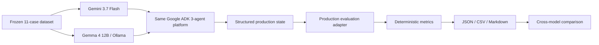

# v1.1 — Evaluation Benchmark

## Purpose

v1.1 adds a reproducible evaluation layer around the existing Gemini Healthcare Agentic Platform.

The objective is not to produce a generic model leaderboard. The objective is to measure whether the same healthcare agent architecture preserves its workflow contracts, evidence boundaries, citations, grounding behavior, and explicit unsupported behavior when executed through different model/runtime paths.

The benchmark therefore separates **application correctness** from **model/runtime variability**.

## Architecture Under Evaluation

```text
User Query
  -> Search Planner Agent
  -> Healthcare Research Agent
  -> MCP retrieval
      -> NPPES
      -> PubMed
      -> FHIR R4
  -> Evidence & Answer Agent
  -> structured grounded answer
```

The benchmark sits outside production:



## Frozen v1.1 Core Acceptance Set

| Evaluation workflow | Cases | Expected behavior |
| --- | ---: | --- |
| Provider discovery | 4 | Supported |
| Biomedical research | 2 | Supported |
| Health information | 1 | Supported |
| FHIR interoperability | 2 | Supported |
| Care program discovery | 1 | Explicitly unsupported |
| Clinical trials | 1 | Explicitly unsupported |
| **Total** | **11** | |

The two unsupported cases are part of the benchmark because explicit failure is safer than silently routing a query to an unrelated retrieval source.

## Dataset Design

The benchmark runner sends only the case query into the production workflow. Expected location or specialty metadata is not injected into production state, because doing so would hide planner failures.

The original Houston pediatric-dentist scenario remains one flagship acceptance case, not application configuration.

## Evaluation Metrics

Provider discovery checks:

```text
retrieval_presence
required_source_types
citation_presence
citation_reference_integrity
claim_support
provider_evidence_authority
fhir_provider_recommendation_boundary
candidate_count
forbidden_claim_flags
```

Biomedical, health-information, FHIR, and unsupported workflows receive only the metrics relevant to their contracts.

Expected unsupported workflows pass only when the workflow rejects the unsupported retrieval path explicitly.

## Why Deterministic Evaluation First?

v1.1 intentionally does not use an LLM-as-judge.

The baseline is designed to be reproducible, inspectable, workflow-specific, and independent from a second model's subjective scoring.

Future semantic evaluation may supplement this layer, but should not replace deterministic source, citation, grounding, and safety checks.

## Preserved First-Run Results

### Model Summary

| Model path | Core cases | Passed | Supported completions | Expected unsupported passed | Pass rate | Median latency | Mean latency |
| --- | ---: | ---: | ---: | ---: | ---: | ---: | ---: |
| Gemini 3.7 Flash | 11 | 11 | 9 / 9 | 2 / 2 | 1.0000 | 10.602 s | 9.442 s |
| Gemma 4 12B + local Ollama | 11 | 10 | 8 / 9 | 2 / 2 | 0.9091 | 167.415 s | 229.241 s |

These are acceptance outcomes for the frozen v1.1 dataset, not general healthcare-AI accuracy figures.

### Workflow Comparison

| Workflow | Gemini | Gemma |
| --- | ---: | ---: |
| Provider discovery | 4 / 4 | 4 / 4 |
| Biomedical research | 2 / 2 | 2 / 2 |
| Health information | 1 / 1 | 1 / 1 |
| FHIR interoperability | 2 / 2 | 1 / 2 |
| Expected unsupported | 2 / 2 | 2 / 2 |

### Deterministic Metric Comparison

| Metric family | Gemini | Gemma |
| --- | ---: | ---: |
| Candidate count | 4 / 4 | 4 / 4 |
| Citation presence | 9 / 9 | 8 / 8 |
| Citation reference integrity | 9 / 9 | 8 / 8 |
| Claim support | 4 / 4 | 4 / 4 |
| Explicit unsupported status | 2 / 2 | 2 / 2 |
| FHIR provider-recommendation boundary | 6 / 6 | 5 / 5 |
| Forbidden provider claim flags | 4 / 4 | 4 / 4 |
| Provider evidence authority | 4 / 4 | 4 / 4 |
| Required source types | 8 / 8 | 7 / 7 |
| Retrieval presence | 9 / 9 | 8 / 8 |

The `execution_success` metric appears only for a failed supported execution in the current reporting contract. Gemma records 0 / 1 for its one failed FHIR execution; Gemini has no corresponding applicable failure row.

## Preserved Gemma Failure

The failed case was `fhir_practitioner_role`.

The local model path exceeded the configured 600-second timeout:

```text
LiteLLM -> Ollama -> Gemma
Timeout passed = 600 seconds
```

This was an execution failure, not a grounding, citation, provider-evidence-authority, provider-safety, or FHIR recommendation-boundary failure.

The first measured failure is intentionally preserved rather than replaced with a retry. A later retry can be saved separately as a recovery/reliability experiment.

## Runtime Context

Gemini:

```text
Model: gemini-3.7-flash
Runtime: hosted Gemini API
```

Gemma:

```text
Model: gemma4:12b
Adapter: LiteLLM
Runtime: Ollama
Host: Apple M3 Pro
Memory: 36 GB
```

These are materially different runtime environments. Latency is therefore operational diagnostic evidence, not a controlled model-superiority benchmark.

## Reproduce

Gemini:

```bash
python -m evaluation.benchmark --provider gemini
```

Gemma:

```bash
python -m evaluation.benchmark --provider gemma
```

Comparison:

```bash
python -m evaluation.comparison
```

## Result Artifacts

```text
evaluation/results/gemini/
evaluation/results/gemma/
evaluation/results/comparison/
```

The comparison is generated from stored benchmark evidence. Do not manually rewrite measured values after the run.

## Healthcare Evidence Boundaries Preserved

NPPES supports provider identity, NPI, taxonomy, and reported location. It does not establish “best” status, board certification, active licensure, good standing, clinical quality, or requested service availability.

PubMed provides general scientific context and does not establish provider-specific quality claims.

Public HAPI FHIR data is used as interoperability evidence, not provider-quality evidence, and is excluded from provider recommendation selection.

## Safety Interpretation

Both model paths passed all applicable deterministic provider-discovery safety checks on completed provider cases.

This does not mean either model or the platform is clinically validated, universally safe, HIPAA compliant, PHI-safe, or suitable for autonomous medical decision-making.

## Limitations

The v1.1 Core Acceptance Benchmark:

1. contains only 11 cases;
2. is a software acceptance benchmark, not a statistically comprehensive healthcare evaluation;
3. uses live external retrieval sources whose returned records can change;
4. permits model planning variability;
5. compares different runtime environments;
6. preserves one full first-run benchmark per model path;
7. does not use an LLM-as-judge;
8. does not evaluate diagnosis quality, treatment quality, patient outcomes, or clinical efficacy.

## Research Extension

A paper-oriented expansion should keep this 11-case release benchmark intact and add a separate frozen research dataset with 50–100+ stratified queries, repeated runs, environment/version metadata, failure taxonomy, controlled recovery experiments, and appropriate statistical reporting.

Potential framing:

> **Beyond RAG: A Reproducible Evaluation Framework for Evidence-Grounded Multi-Agent Healthcare Search Using Gemini, Gemma, Google ADK, and MCP**

Candidate research questions:

```text
RQ1. How reliably does the architecture preserve evidence-grounding contracts across heterogeneous healthcare sources?

RQ2. How effectively do deterministic provider-grounding rules prevent unsupported provider claims and citation failures?

RQ3. How does the same Google ADK multi-agent architecture behave under hosted Gemini and locally controlled Gemma paths?

RQ4. How does behavior differ across provider discovery, biomedical research, health information, and FHIR interoperability?

RQ5. What operational trade-offs appear across model/runtime configuration, latency, retrieval, completeness, grounding, and safety?
```

The research framing should evaluate architecture behavior and reproducibility, not declare one model universally better than another.

## Next Milestone

v1.2 moves the accepted application and evaluation behavior toward Kubernetes / GKE deployment while preserving the v1.1 dataset and metrics for regression checking.
